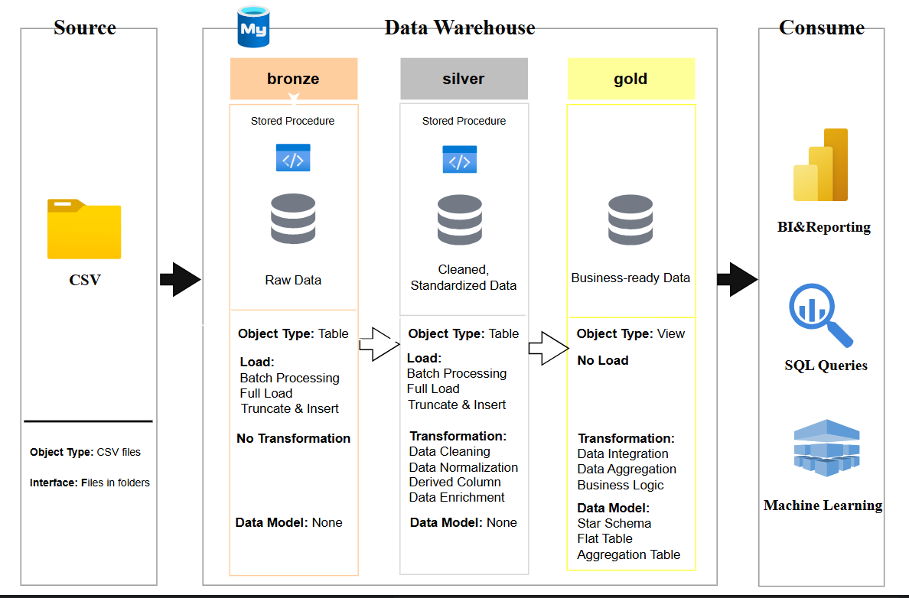

# Data Warehouse and Analytics
----

Welcome to the **Data Warehouse and Analytics** repository.
This project demostrates data warehousing and analytics of an e-commerce store.  It builds an effective warehouse for data effectiveness and data analytics for actionable insights.

---

## Project Requirement 

## Building the Data warehouse (Data Engineering)

#### Objectives 
Develop a warehouse using SQL Server to consolidate the e-commerce store data, enabling analytical reporting and data-driven decision-making.

#### Specifications
•	**Data Sources**: Import data from data warehouse provided as CSV files.

•	**Data Quality**: Cleanse and resolve data quality issues prior to analysis

•	**Integration**: Integrate data into a single, user-friendly data model designed for analytical queries.

•	**Scope**: focus on the latest dataset only.

•	**Documentation**: Provide clear documentation of the data model to support both business stakeholders and analytics teams.

---

### BI: Analytics & Reporting (Data Analytics)

### Objectives 
Develop SQL-based analytics for actionable insights into:

•	**Product Performance**

•	**Cus•	**Marketing Perfomance**
tomer Behaviour**

•	**Customer Values**

•	**Sales Trends**

These insights empower stakeholders with business metrics for strategic decision-making.

---

## Data Architecture

This project adopts the medallion architecture: Bronze, Silver, and Gold layer.

1. **Bronze:** Stores raw data without changes from source systems. Data from CSV files are ingested into a SQL server for analysis
2. **Silver:** Data were cleaned, standardized, and normalized for analysis.
3. **Gold:** Stores business-ready data modelled for a star schema for analysis and reporting.    

---

## Responsitory Structure

project-name/

project-name/
├── datasets/                     # Raw datasets used for the project
│   ├── customers.csv             # Customer data
│   ├── order_items.csv           # Order item-level details
│   ├── orders.csv                # Order-level data
│   └── products.csv              # Product details
│
├── doc./                         # Project documentation and architecture
│   ├── Data_dictionary.pdf       # Data dictionary for the schema
│   ├── data_architecture.png     # System/data architecture diagram
│   ├── data_flow.png             # Data flow diagram
│   └── data_model.png            # Data model (e.g., star schema)
│
├── script/                       # SQL scripts for ETL and schema creation
│   ├── bronze/                   # Scripts for raw data extraction and staging
│   ├── silver/                   # Scripts for cleaning and transforming data
│   ├── gold/                     # Scripts for final analytical layer
│   └── init_database.sql         # Database initialization script
│
├── tests/                        # Test scripts and data quality checks
│   ├── quality_checks_gold.sql   # Quality checks for the Gold layer
│   └── quality_checks_silver.sql # Quality checks for the Silver layer
│
├── LICENSE                       # License information for the project
└── README.md                     # Project overview and setup instructions

---
## Licence

This project is licenced under the (MIT Licence) LICENSE. You are free to use, modify, and share this project with proper attribution

## About Me

Hi, I'm oladigbolu taofeek...

